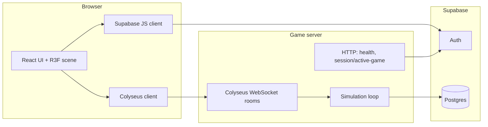

# Hunter vs Runner

Real-time **2-player 3D browser game**: one player is the **Hunter** (catch the Runner before time runs out), the other is the **Runner** (survive **2 minutes**). Built as a portfolio-grade full-stack project with authoritative server simulation, Supabase authentication, and a React Three Fiber client.

---

## Highlights (for reviewers)

- **Authoritative multiplayer**: game state and physics run on a **Colyseus** room; clients use prediction for responsiveness.
- **Auth & data**: **Supabase Auth** (email magic link) and **Postgres** for users and match results (RLS-ready schema in `docs/supabase-migration.sql`).
- **Modern stack**: **NestJS** bootstrap + Colyseus, **Vite + React + TypeScript**, **React Three Fiber** for the arena and characters.
- **Shared map config**: `backend/src/map-config.ts` is the single source of truth for arena geometry; the frontend imports it via a Vite alias (`@map-config`) so client prediction matches the server.

---

## How it works



1. **Sign-in**: the user authenticates with Supabase (magic link). Tokens are used for protected flows.
2. **Matchmaking**: both players connect to the Colyseus server and join a **game room** (`game_classic` / `game_maze`).
3. **Gameplay**: input is sent to the server; the server updates positions, stamina, and catch logic; state is broadcast to clients. The client renders the 3D scene and can run prediction against the same map data as the server.
4. **Session check**: the frontend may call `GET /session/active-game` on the backend (HTTP) with a Bearer token to see if the user is already in a room—`VITE_BACKEND_HTTP_ENDPOINT` must point at that HTTP API.

---

## Tech stack

| Layer | Technology |
| --- | --- |
| Frontend | Vite, React, TypeScript |
| 3D | React Three Fiber, `@react-three/drei`, `@react-three/postprocessing` |
| Realtime client | Colyseus.js |
| State | Zustand |
| Routing | React Router |
| Styling | Tailwind CSS v4 (dark / neon theme) |
| Backend | NestJS (bootstrap, DI) + Colyseus 0.17 (HTTP + WebSocket) |
| Auth & DB | Supabase Auth + Postgres |

---

## Repository structure

```
multiplayer-3d/
├── frontend/                 # Vite + React + R3F client
│   ├── src/
│   │   ├── routes/           # Start, matchmaking, game, auth callback
│   │   ├── lib/              # Supabase, Colyseus, env-based config
│   │   ├── state/            # Zustand (auth, matchmaking, game)
│   │   ├── game/             # Input, prediction, net, obstacles (uses @map-config)
│   │   ├── r3f/              # Scene, arena, players, lights
│   │   └── ui/               # HUD, countdown, end screen
│   ├── Dockerfile            # build context: repository root (see file)
│   └── nginx.conf
├── backend/                  # Colyseus + NestJS context
│   └── src/
│       ├── main.ts           # Server, CORS, /health, /session/active-game, room defs
│       ├── map-config.ts     # Shared map definitions (imported by frontend)
│       ├── colyseus/
│       │   ├── rooms/        # Game room (match flow, tick)
│       │   ├── state/        # Schema types
│       │   └── logic/        # Movement, stamina, catch, spawns
│       ├── supabase/         # Service role client, JWT verification
│       ├── auth/             # Auth-related types
│       └── health/           # Health module (used from main)
├── docs/
│   ├── supabase-migration.sql
│   ├── deployment-checklist.md
│   └── …                     # design / planning notes
├── e2e/                      # Playwright smoke tests (start screen, routing, optional /health)
├── docker-compose.yml        # Backend + frontend (nginx) stack
└── README.md
```

---

## Prerequisites

- **Node.js 20+**
- A **Supabase** project with the **Email** provider enabled (free tier is enough)

---

## First-time setup

### 1. Supabase (database & auth)

1. Create a project at [supabase.com](https://supabase.com).
2. In **SQL Editor**, run the full contents of `docs/supabase-migration.sql` (tables, RLS, helpers).
3. **Authentication → Providers**: enable **Email**.
4. For a smooth magic-link-only flow, disable mandatory email confirmation if your project still requires a separate “confirm email” step before the magic link works.

### 2. Supabase API keys

**Settings → API**:

- Project URL → `SUPABASE_URL` / `VITE_SUPABASE_URL`
- `anon` **public** key → `VITE_SUPABASE_ANON_KEY`
- `service_role` **secret** key → `SUPABASE_SERVICE_ROLE_KEY` (backend only; never expose in the browser)

### 3. Frontend environment

```bash
cd frontend
cp .env.example .env
```

| Variable | Purpose |
| --- | --- |
| `VITE_SUPABASE_URL` | Supabase project URL |
| `VITE_SUPABASE_ANON_KEY` | Public anon key |
| `VITE_COLYSEUS_ENDPOINT` | WebSocket URL of the game server (`ws://` dev, `wss://` production HTTPS) |
| `VITE_BACKEND_HTTP_ENDPOINT` | HTTP base URL for REST routes on the same host (e.g. `http://localhost:2567`). Used for `/session/active-game`. If omitted, it is derived from `VITE_COLYSEUS_ENDPOINT` by swapping `ws`→`http` / `wss`→`https`. |
| `VITE_SITE_URL` | Public site URL (OAuth / magic-link redirects), e.g. `http://localhost:5173` |

Example **local development**:

```env
VITE_SUPABASE_URL=https://your-project.supabase.co
VITE_SUPABASE_ANON_KEY=your-anon-key
VITE_COLYSEUS_ENDPOINT=ws://localhost:2567
VITE_BACKEND_HTTP_ENDPOINT=http://localhost:2567
VITE_SITE_URL=http://localhost:5173
```

### 4. Backend environment

```bash
cd backend
cp .env.example .env
```

| Variable | Purpose |
| --- | --- |
| `NODE_ENV` | `development` or `production` |
| `PORT` | Listen port (default `2567`) |
| `CORS_ORIGIN` | Allowed browser origin(s), comma-separated. Supports patterns like `https://*.vercel.app`. |
| `SUPABASE_URL` | Same project URL as the frontend |
| `SUPABASE_SERVICE_ROLE_KEY` | Service role key (server only) |

Example **local development**:

```env
NODE_ENV=development
PORT=2567
CORS_ORIGIN=http://localhost:5173
SUPABASE_URL=https://your-project.supabase.co
SUPABASE_SERVICE_ROLE_KEY=your-service-role-key
```

### 5. Install dependencies

```bash
cd frontend && npm install
cd ../backend && npm install
```

---

## Running in development

Use **two terminals** (backend first is recommended so WebSocket and HTTP routes are ready).

**Terminal 1 — backend**

```bash
cd backend
npm run start:dev
```

- HTTP + WebSocket: `http://localhost:2567`
- Health: [http://localhost:2567/health](http://localhost:2567/health)

**Terminal 2 — frontend**

```bash
cd frontend
npm run dev
```

- App: [http://localhost:5173](http://localhost:5173)

Open **two browser windows** (or a normal window + incognito) to test Hunter vs Runner.

### E2E tests (Playwright)

From `e2e/`, install dependencies and browsers once, then run the suite. Playwright starts the Vite dev server automatically (`reuseExistingServer` is enabled locally so you can also run `npm run dev` in `frontend/` yourself).

```bash
cd e2e
npm install
npx playwright install
cp .env.example .env   # optional: edit .env to turn on backend HTTP test (see below)
npm run test:e2e
```

**Optional env vars** are documented in [`e2e/.env.example`](e2e/.env.example). After `cp .env.example .env`, keep `E2E_BACKEND_URL` (see example) so `tests/backend-health.spec.ts` runs—**start the backend first** in another terminal (`cd backend && npm run start:dev`). The URL uses `127.0.0.1` to avoid IPv6 `localhost` issues. Variables from `e2e/.env` are loaded automatically by Playwright config.

**Backend unit tests** (Jest, from `backend/`):

```bash
cd backend
npm test
npm run test:e2e
```

(`npm run test:e2e` in `backend/` runs Nest’s HTTP e2e spec against `AppModule`, including `GET /health`.)

---

## Production build (local)

```bash
# Backend
cd backend
npm run build
npm run start:prod

# Frontend
cd frontend
npm run build
# Static output: frontend/dist — serve with any static host or nginx
```

---

## Deployment notes

Typical setup: **frontend** on a static host (e.g. Vercel) and **backend** on a container-friendly host (e.g. Render, Railway, Fly.io) using the provided `backend/Dockerfile`.

**Frontend (build-time env):** set `VITE_*` variables in the hosting dashboard. For HTTPS sites, use `wss://` for `VITE_COLYSEUS_ENDPOINT` and `https://` for `VITE_BACKEND_HTTP_ENDPOINT`.

**Backend:** set `NODE_ENV=production`, `PORT`, `CORS_ORIGIN` to your frontend origin(s), and Supabase secrets.

**Supabase:** add the production redirect URL: `https://<your-domain>/auth/callback`.

**Post-deploy checklist:** see `docs/deployment-checklist.md`.

---

## Docker

From the **repository root** (backend reads `backend/.env`; the frontend image is built with Vite—ensure any required `VITE_*` values are available at **build** time if you build images locally, e.g. via `docker compose build --build-arg` or a CI step that injects env):

```bash
docker compose up --build -d
docker compose logs -f
docker compose down
```

---

## Game rules

| | |
| --- | --- |
| Roles | Hunter (warm colors) vs Runner (cool colors) |
| Controls | WASD move, **Shift** sprint (stamina) |
| Match length | 2:00 |
| Catch | Hunter within range for a short window (server-side) |
| Win | Hunter catches Runner → Hunter wins; timer hits 0 → Runner wins |
| Matchmaking | Real-time queue, limited wait |

---

## Known limitations

- Keyboard-focused controls (no on-screen joystick).
- Single game server process; horizontal scaling would require Colyseus distributed / Redis, etc.
- Mixed content: never use `ws://` on an HTTPS page—use `wss://` in production.

---

## Portfolio / ops quick reference

- Backend health: `https://<your-backend-domain>/health` should return `{"status":"ok"}`.
- If clients cannot connect: verify `VITE_COLYSEUS_ENDPOINT`, `CORS_ORIGIN`, and HTTPS/`wss` pairing.
- Optional: monitor `/health` with an external uptime checker.
